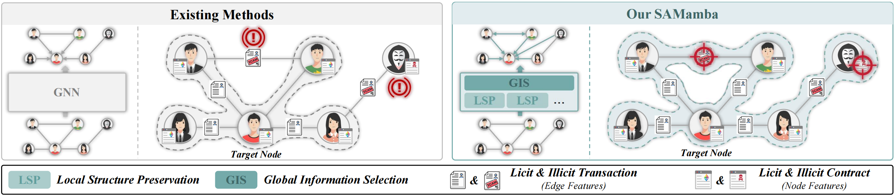

# SAMamba: Structure-Aware Mamba for Ethereum Account De-anonymization

More details of this project will be released soon.

## Network Architecture

Comparison of SAMamba with standard GNN-based methods. Existing methods use GNN’s message passing mechanism similar to the 1-WL
algorithm to encode the subtree structure around a target node, and a layer of GNN aggregates one-hop neighbors around the target node. SAMamba encodes
a subgraph around a target node, allowing transactions between neighbors to be perceived, and broadens the receptive field to the full-graph perspective to
gather information about high-order neighborhoods.

## Data Description
### lw_AIG dataset

Size: 5732 graphs, divided into four sub-datasets, Eth-ICO, Eth-mining, Eth-Exchange, Eth-Phish&Hack, with 146, 130, 386, 5070 graphs respectively.

Challenge: The challenge on the lw-AIG dataset is to perform binary classification on all graphs in each sub-dataset.

In the lw-AIG dataset, nodes serve as representations of accounts, while edges encode transaction data and contract callback information. The dataset is stratified into four distinct subsets according to account identity labels derived from the Label Word Cloud of the Ethereum blockchain explorer: ICO wallets, mining accounts, exchange accounts, and phishing&hack accounts. For each subset, graph sampling is performed based on varying edge attributes—Amount, Times, or avgAmount—yielding three distinct graph types. Each graph is anchored to a target account, with the label of the target account assigned as the graph’s label. This setup facilitates the learning of a mapping function that associates graph patterns with account identity labels, enabling the modeling of structural and behavioral characteristics specific to different account types within the Ethereum ecosystem.

### EPTransNet dataset

Size: The original graph includes 2,973,382 nodes and 13,551,214 edges, and the number of labeled phishing nodes is 1,157.

Challenge: The challenge on the EPTransNet dataset is to perform binary classification for each node.

Given the large scale of the original EPTransNet graph, random walk algorithm is employed to sample subgraphs of sizes 30,000, 40,000, and 50,000 nodes, respectively. During the sampling phase, the graph is treated as undirected, with directional edges directly converted to undirected ones to ensure undirected neighbor relationships. The node classification task is subsequently performed on these three subgraphs with distinct sizes.

